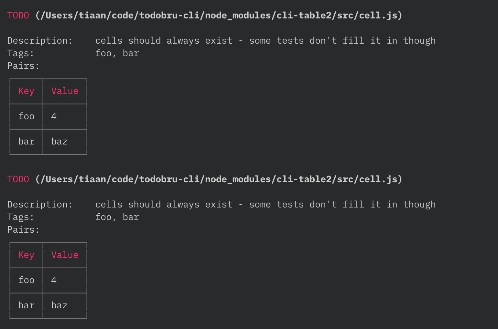

<div align="center">
    
</div>

# todobru-cli
[](https://npmjs.org/package/todobru-cli)
[](https://npmjs.org/package/todobru-cli)
[](https://github.com/RichardLitt/standard-readme)
[](https://npmjs.org/package/todobru-cli)
[](http://makeapullrequest.com)

> Scan project for TODOs, FIXMEs, HACKs or whatever

## Table of Contents

- [Install](#install)
- [Usage](#usage)
- [Contribute](#contribute)
- [License](#License)

## Install

This project uses [node](https://nodejs.org) and [npm](https://www.npmjs.com). 

```sh
$ npm install -g todobru-cli
$ # OR
$ yarn global add todobru-cli
```

## Usage

```sh
$ todobru
```

## Contribute

1. Fork it and create your feature branch: `git checkout -b my-new-feature`
2. Commit your changes: `git commit -am "Add some feature"`
3. Push to the branch: `git push origin my-new-feature`
4. Submit a pull request

## License

MIT
    